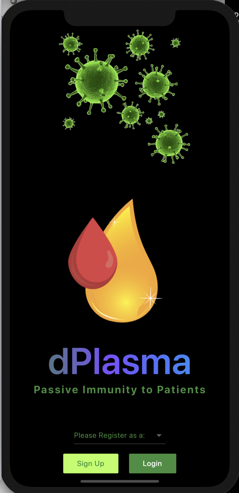

# dPlasma

P2P is the new "Plasma to Patients"!! Come and get to know our DDD (Decentralized Data Donors) model at the DPKI that we BUIDL. Okok...Decentralized Public Key Infrastructure...and yes... BUIDL is the new HODL. 

dPlasma is a way to connect Patients and Donors globally. With this App, anyone, anywhere in the world, would be able to donate blood components at Blood Centers, regardless of their nationality. We are all one planet, and one planet in pandemic mode should be able to access a network of global donors. We travel a lot, we change our locations very often, we should be able to help patients in need in any city of the world.

### Getting Started

This project was build with Flutter.
A few resources to get you started if this is your first Flutter project:
- [Lab: Write your first Flutter app](https://flutter.dev/docs/get-started/codelab)
- [Cookbook: Useful Flutter samples](https://flutter.dev/docs/cookbook)
For help getting started with Flutter, view our
[online documentation](https://flutter.dev/docs), which offers tutorials,
samples, guidance on mobile development, and a full API reference.

### Deploy dPlasma.sol Smart Contract at any Ethereum Network

You will find the dPlasma.sol latest version at: https://github.com/itsencrypted/dPlasma_API/blob/master/dPlasma.sol
Get contract ABI.json and paste it on the folder dPlasma/assets/contract/abi.json
Get the contract address and paste it at dPlasma/constants.dart for example:
const String dPlasmaContractAddress = "0x7C831Ec9ef9AB4672A047b4fa47B0E4b41EA25d4";

### Connect flutter to an Ethereum node

For this projects we used an Infura API, which can be found as a const on the folder constants.dart
We also tested Amberdata's endpoint to connect with Rinkeby. 
Either one you pick, they both can be saved as a const apiUrl = "<your_favorite_Ethereum_node_provider_Api_here>"

### Back to Android Studio, save those changes and BUILD project on your favorite emulator

Because we build it with Flutter, you will be able to run the project on both Android and iOS.
Go to pubspec.yaml file and Get Dependencies first.
It is expected a long runtime (more than 3 minutes), once you build the project for the first time.
After that, the Hot Re-start button can build the project for you in less than 30 seconds.
Press the hot re-start every time you need to break the state and check some functionalities.
Press the hot reload button every time you change a stateless widget that doesn't require you to break the current state.

### For Google Maps

Emulator should get your automatic location. We set up a Map of New York city as the "donor-personas" are willing to donate their plasma in New York. The app points all the possible Blood Centers of New York.
This can be replicated to different cities, once the project expands.

### For accessing a lot of potential donors, our DDDs (Decentralized Data Donors), access our exclusive dPlasma_API
### Python3 Environment + Django
https://github.com/itsencrypted/dPlasma_API/tree/master/dash/api_dplasma
In this link you will get access to donors that could potentially donate their plasma using dPlasma
The repository was built in python, and you will need to set up a Python 3 environment to run the shell scripts
The rewards for doing that is that you will be able to access some precious data from the FHIR Database in the US.

